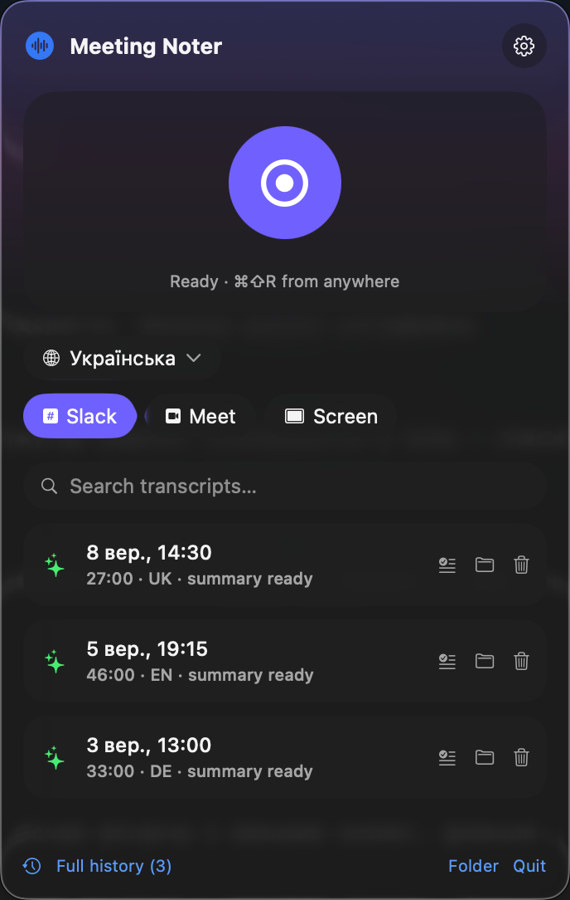
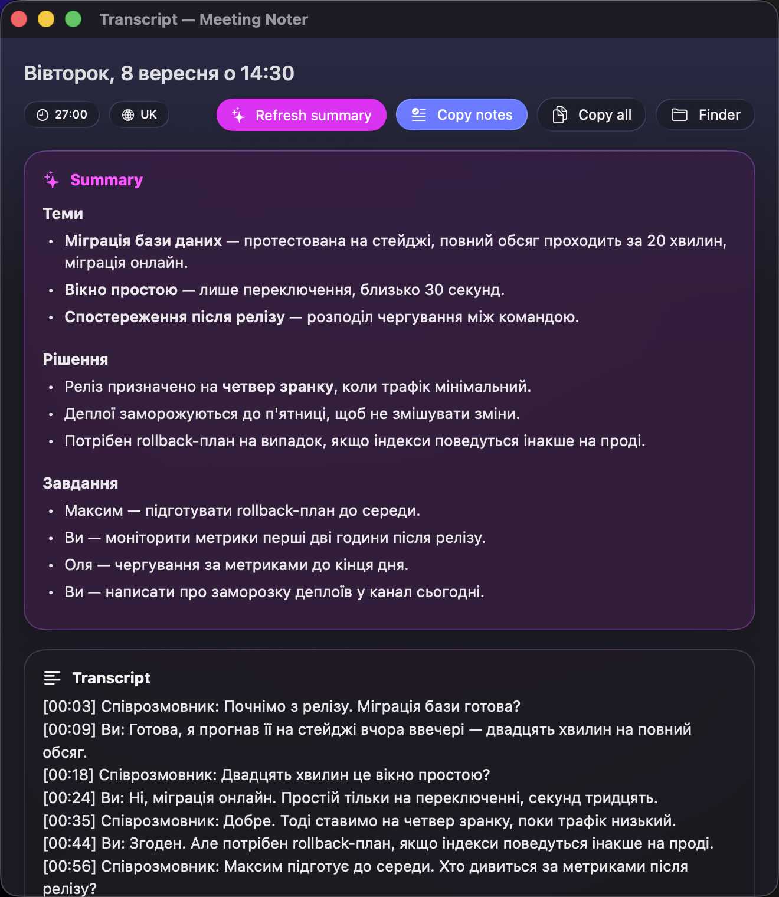

# Meeting Noter

A menu bar app for macOS 26 that records your calls, transcribes them locally, and can summarize them with Claude. Nothing leaves your machine unless you ask for a summary.

**[Download the latest release](https://github.com/deemiles/meeting-noter/releases/latest)** · **[meeting-noter website](https://deemiles.github.io/meeting-noter/)**

Built with SwiftUI and the Liquid Glass design system. No Xcode project — just Swift Package Manager, Sparkle for updates, and ~2,000 lines of Swift.

<p align="center">
  
  &nbsp;&nbsp;
  
</p>

## Why

Every meeting-notes tool wants your audio on their servers. This one keeps it on your laptop: [whisper.cpp](https://github.com/ggerganov/whisper.cpp) does the transcription locally, and the recording never leaves `~/Documents/MeetingNoter`. The only outbound step is optional — pressing ✨ pipes the transcript to the Claude CLI for a summary.

## Features

- **Records the call, not your whole desktop** — pick Slack, a Google Meet tab, or the full screen. ScreenCaptureKit filters by application, so your other windows stay out of the video.
- **Speaker separation without diarization** — the mic and the system audio are captured as two distinct tracks, transcribed separately, and merged by timecode. Lines come out labelled `Me` / `Them`.
- **Five languages** — Ukrainian, English, Spanish, German, Russian. Speaker labels and AI summaries come back in the language the call was held in.
- **Optional AI summaries** — topics, decisions, action items via the Claude CLI (`summary.md`), plus one-click **Copy notes** that flattens the summary into a chat-ready message for Slack or email.
- **Global hotkey ⌘⇧R** — start or stop from any app, with a live timer in the menu bar.
- **Searchable history** — full-text search across every transcript you have ever recorded.
- **Headless re-transcription** — `MeetingNoter --retranscribe <folder> [ru|en]`.
- **Auto-updates** — Sparkle checks in the background and installs in place.

Each recording lands in its own folder:

```
~/Documents/MeetingNoter/2026-06-13 01.08.50/
├── recording.mov      # video + 2 audio tracks (system audio, microphone)
├── transcript.txt     # timecoded text with speaker labels
├── transcript.srt     # subtitles
├── summary.md         # optional, generated by Claude
└── meta.json
```

## Install

**[Download the .dmg](https://github.com/deemiles/meeting-noter/releases/latest/download/MeetingNoter.dmg)**, drag it to Applications, then right-click → Open the first time (it is signed with a self-signed certificate, so Gatekeeper asks once).

whisper.cpp is compiled into the app, so there is no Homebrew step. On first launch the menu offers a speech model — Large v3 Turbo (1.5 GB) or Small (466 MB) — and downloads it with a progress bar into `~/Library/Application Support/MeetingNoter/models/`.

Building from source is one command:

```sh
git clone https://github.com/deemiles/meeting-noter.git
cd meeting-noter
./scripts/build-app.sh          # produces dist/MeetingNoter.app
```

**Requirements:** macOS 26+ (Liquid Glass APIs). Apple Silicon recommended — `large-v3-turbo` transcribes an hour of audio in a couple of minutes on an M-series chip. Building needs Swift 6.2+ via Command Line Tools; rebuilding the bundled whisper binary additionally needs `cmake`.

## Permissions

macOS will ask for two things on first use:

- **Screen & System Audio Recording** — System Settings → Privacy & Security. **Restart the app after granting it**; a running process does not pick up this permission.
- **Microphone** — the system prompt appears on the first recording.

If the permission dialog keeps reappearing no matter how many times you approve it, see [Signing and TCC](#signing-and-tcc) below.

## How it works

| File | Responsibility |
| --- | --- |
| `CallRecorder.swift` | ScreenCaptureKit → `AVAssetWriter`. One `.mov`, 15 fps h264, two AAC audio tracks. |
| `Transcriber.swift` | Per-track normalization → 16 kHz mono WAV → bundled `whisper-cli -oj` → merge by timecode. |
| `ModelDownloader.swift` | Fetches a Whisper model on first launch so no terminal is needed. |
| `SummaryFormatter.swift` | Flattens `summary.md` into a message you can paste into a chat. |
| `Summarizer.swift` | `claude -p` over the transcript → `summary.md`. |
| `AppState.swift` | Recording state machine, search, launch-at-login. |
| `MenuView.swift` | Liquid Glass UI: `glassEffect`, `GlassEffectContainer`, pulsing record button. |
| `HotKey.swift` | Carbon `RegisterEventHotKey` — no Accessibility permission required. |

### Three things that turned out to matter

**Never mix the tracks.** The obvious move is to sum the mic and the system audio into one WAV and hand it to Whisper once. Do not. Two people talking over each other on a single channel interfere, and recognition quality collapses. Transcribing each track separately and merging the segments by timecode is both more accurate *and* gives you speaker labels for free — no diarization model needed.

**Normalize per track, in two passes.** System audio routinely runs past full scale and clips when written to a 16-bit WAV, while a headset mic can be so quiet it lands below Whisper's noise floor. The recorder measures each track's peak in one pass, then rewrites it with a gain that normalizes to 0.85 (boost capped at 30×) in a second pass. Tracks whose peak never exceeds 0.001 are pure silence and get skipped entirely — Whisper hallucinates confidently on silence.

**Filter the hallucinations you cannot prevent.** Whisper models trained on scraped subtitles emit their training data on ambiguous audio: `subtitles by …`, `thanks for watching`, and — for Russian — the name of a prolific subtitle author. A small blocklist catches the recurring ones.

### Signing, TCC, and why auto-updates need a stable certificate

macOS ties Screen Recording permission to the app's *designated requirement*. Sign ad-hoc (`codesign --sign -`) and that requirement is the binary's `cdhash` — so **every rebuild and every auto-update invalidates the permission the user granted**. Worse, the toggle in System Settings then updates the stored authorization without updating the code requirement, which produces an infinite prompt loop no amount of clicking fixes. The log line to look for:

```
Failed to match existing code requirement for subject <bundle-id>
and service kTCCServiceScreenCapture
```

Signing with a stable certificate — even a self-signed one, no paid Developer ID required — changes the requirement to:

```
identifier "com.dmytro.meetingnoter" and certificate root = H"..."
```

That survives rebuilds and Sparkle updates. `build-app.sh` looks for an identity named `Meeting Noter` and falls back to ad-hoc with a warning if it is missing. Create your own once:

```sh
openssl req -x509 -newkey rsa:2048 -keyout key.pem -out cert.pem -days 7300 -nodes \
  -subj "/CN=Meeting Noter/O=Meeting Noter/C=US" \
  -addext "extendedKeyUsage=critical,codeSigning" \
  -addext "basicConstraints=critical,CA:false"
openssl pkcs12 -export -out cert.p12 -inkey key.pem -in cert.pem -passout pass:PASSWORD \
  -certpbe PBE-SHA1-3DES -keypbe PBE-SHA1-3DES -macalg sha1
security import cert.p12 -k ~/Library/Keychains/login.keychain-db -P PASSWORD -T /usr/bin/codesign -A
```

Keep that key. Signing a later release with a *different* certificate breaks the requirement for everyone who already installed the app.

If you do end up stuck in the prompt loop:

```sh
pkill -x MeetingNoter
tccutil reset ScreenCapture com.dmytro.meetingnoter
tccutil reset Microphone com.dmytro.meetingnoter
open dist/MeetingNoter.app
# grant the permissions, then restart the app once more
```

### Notarization

With an Apple Developer Program membership, `build-app.sh` picks up a `Developer ID Application` certificate automatically, switches on Hardened Runtime, and applies `Resources/MeetingNoter.entitlements` (Hardened Runtime blocks microphone access without `com.apple.security.device.audio-input`; screen recording needs no entitlement). Sparkle's XPC services, `Autoupdate`, and `Updater.app` are signed individually in the order Sparkle documents — never with `--deep`.

Then, once per machine:

```sh
xcrun notarytool store-credentials meeting-noter \
    --apple-id "you@example.com" --team-id "TEAMID" --password "app-specific-password"
```

and per release:

```sh
./scripts/notarize.sh   # submits the dmg, waits, staples the ticket
```

Without a Developer ID the build falls back to the self-signed certificate and skips Hardened Runtime — everything still works, users just need right-click → Open once.

### Releasing

```sh
VERSION=1.1 BUILD=2 ./scripts/build-app.sh   # CFBundleVersion must increase
VERSION=1.1 ./scripts/make-dmg.sh            # builds the dmg, prints the EdDSA signature
gh release create v1.1.0 dist/MeetingNoter.dmg   # keep the asset name stable
# paste the signature and length into docs/appcast.xml, then push
```

Updates are served from `docs/appcast.xml` on GitHub Pages and verified with an EdDSA key held in the maintainer's keychain.

## Building

```sh
swift build -c release      # binary only
./scripts/build-app.sh      # full .app bundle: icon, whisper, Sparkle, signature
./scripts/build-whisper.sh  # rebuild the bundled whisper-cli (needs cmake)
./scripts/make-dmg.sh       # disk image + appcast signature
```

`build-whisper.sh` compiles whisper.cpp with `BUILD_SHARED_LIBS=OFF` and `GGML_METAL_EMBED_LIBRARY=ON`, producing a 3 MB binary that links only against system frameworks — which is what lets the app ship without Homebrew.

The icon is generated from code — `scripts/make-icon.swift` draws a gradient squircle and a waveform, then packs it with `iconutil`. Two more scripts help when audio goes wrong: `analyze-recording.swift` prints RMS and peak per track, `mix-wav.swift` exports a normalized mix.

## Limitations

- macOS 26 only — the UI leans on Liquid Glass APIs that do not exist on earlier versions.
- Meet detection matches browser window titles, so a renamed tab can throw it off.
- The app UI is in English; transcripts support Ukrainian, English, Spanish, German and Russian.
- Not notarized — signed with a self-signed certificate, so the first launch needs right-click → Open.

## Legal note

Recording a conversation without the consent of everyone on the call is illegal in many jurisdictions. Tell the other side you are recording.

## License

MIT — see [LICENSE](LICENSE).
